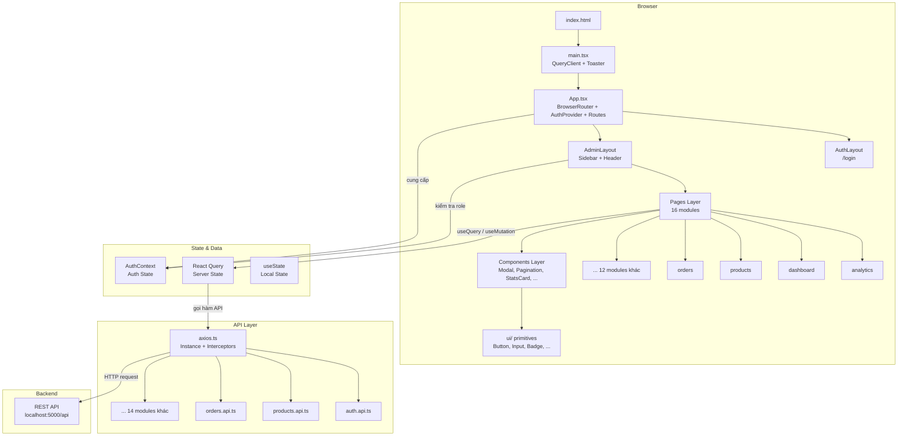
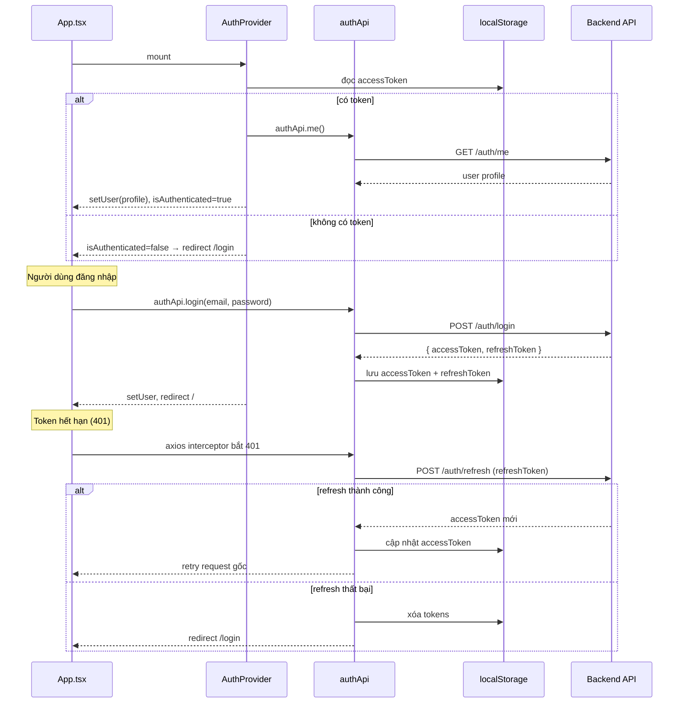

# AGENTS.md — ecommerce-admin

> Tài liệu hướng dẫn cho agent AI và lập trình viên mới tham gia dự án.
> Mọi nội dung trong file này được viết bằng **tiếng Việt**.

---

## Mục lục

1. [Tổng quan dự án](#1-tổng-quan-dự-án)
2. [Cấu trúc thư mục](#2-cấu-trúc-thư-mục)
3. [Kiến trúc hệ thống](#3-kiến-trúc-hệ-thống)
4. [Lệnh thường dùng (Worker Config)](#4-lệnh-thường-dùng-worker-config)
5. [Biến môi trường](#5-biến-môi-trường)
6. [Luồng xác thực](#6-luồng-xác-thực)
7. [Lớp API](#7-lớp-api)
8. [Routing](#8-routing)
9. [Patterns & Quy ước](#9-patterns--quy-ước)
10. [Xử lý lỗi](#10-xử-lý-lỗi)
11. [Quy trình phát triển](#11-quy-trình-phát-triển)
12. [Chính sách ngôn ngữ](#12-chính-sách-ngôn-ngữ)

---

## 1. Tổng quan dự án

**ecommerce-admin** là một Single Page Application (SPA) dùng làm **bảng điều khiển quản trị** cho hệ thống thương mại điện tử.

| Thuộc tính | Chi tiết |
|-----------|---------|
| Framework | React 18 + TypeScript |
| Build tool | Vite |
| Styling | Tailwind CSS |
| State server | React Query (TanStack Query v5) |
| Forms | React Hook Form + Zod |
| HTTP client | Axios (instance dùng chung) |
| Notifications | react-hot-toast |
| Routing | React Router DOM v6 |
| Backend API | REST — mặc định `http://localhost:5000/api` |

Ứng dụng phục vụ hai nhóm người dùng: **admin** (toàn quyền) và **staff** (quyền hạn chế). Mọi route trừ `/login` đều được bảo vệ bằng xác thực.

---

## 2. Cấu trúc thư mục

```
ecommerce-admin/
├── index.html                  # Entry point HTML, nạp src/main.tsx
├── vite.config.ts              # Cấu hình Vite
├── tsconfig.json               # Cấu hình TypeScript
├── tailwind.config.js          # Cấu hình Tailwind CSS
├── .env.example                # Template biến môi trường
├── .env                        # Biến môi trường thực (không commit)
└── src/
    ├── main.tsx                # Bootstrap: React, QueryClient, Toaster
    ├── App.tsx                 # BrowserRouter, AuthProvider, định nghĩa routes
    ├── api/                    # 17 module Axios theo tính năng
    │   ├── axios.ts            # Axios instance dùng chung + interceptors
    │   ├── auth.api.ts
    │   ├── products.api.ts
    │   ├── categories.api.ts
    │   ├── brands.api.ts
    │   ├── orders.api.ts
    │   ├── payments.api.ts
    │   ├── shipments.api.ts
    │   ├── coupons.api.ts
    │   ├── flashSales.api.ts
    │   ├── banners.api.ts
    │   ├── reviews.api.ts
    │   ├── conversations.api.ts
    │   ├── notifications.api.ts
    │   ├── settings.api.ts
    │   ├── upload.api.ts
    │   └── analytics.api.ts
    ├── components/             # Component dùng chung
    │   ├── Sidebar.tsx
    │   ├── Header.tsx
    │   ├── Modal.tsx
    │   ├── Pagination.tsx
    │   ├── Spinner.tsx
    │   ├── StatsCard.tsx
    │   ├── ConfirmDialog.tsx
    │   └── ui/                 # UI primitives (Button, Input, Badge, ...)
    ├── context/
    │   └── AuthContext.tsx     # Trạng thái xác thực toàn cục
    ├── hooks/
    │   └── useDebounce.ts      # Debounce cho input tìm kiếm
    ├── layouts/
    │   ├── AdminLayout.tsx     # Sidebar + Header, kiểm tra role
    │   └── AuthLayout.tsx      # Layout trang login
    ├── lib/
    │   ├── formatCurrency.ts   # Định dạng tiền tệ VND
    │   ├── formatDate.ts       # Định dạng ngày tháng
    │   └── cn.ts               # clsx + tailwind-merge helper
    └── pages/                  # 16 module trang chức năng
        ├── analytics/
        ├── auth/               # Trang đăng nhập
        ├── banners/
        ├── brands/
        ├── categories/
        ├── conversations/
        ├── coupons/
        ├── dashboard/
        ├── flash-sales/
        ├── notifications/
        ├── orders/
        ├── payments/
        ├── products/
        ├── reviews/
        ├── settings/
        └── shipments/
```

### Quy ước đặt tên file

| Loại | Quy ước | Ví dụ |
|------|---------|-------|
| Component / Page | PascalCase | `ProductList.tsx`, `OrderDetail.tsx` |
| Hook | camelCase, tiền tố `use` | `useDebounce.ts`, `useProducts.ts` |
| API module | `featureName.api.ts` | `products.api.ts`, `orders.api.ts` |
| Utility | camelCase | `formatCurrency.ts`, `cn.ts` |
| Context | PascalCase + `Context` | `AuthContext.tsx` |

---

## 3. Kiến trúc hệ thống

### Sơ đồ các lớp



### Mô tả các lớp

| Lớp | File/Thư mục | Trách nhiệm |
|-----|-------------|-------------|
| **Entry Point** | `main.tsx` | Khởi tạo React root, cấu hình QueryClient, gắn Toaster |
| **App** | `App.tsx` | Bọc BrowserRouter, AuthProvider; khai báo tất cả routes |
| **Layout** | `layouts/` | AdminLayout (sidebar + header + guard role), AuthLayout (login UI) |
| **Pages** | `pages/` | Logic nghiệp vụ từng tính năng, gọi API qua React Query |
| **Components** | `components/` | UI dùng chung không gắn với nghiệp vụ cụ thể |
| **API** | `api/` | Các hàm gọi HTTP, mỗi file tương ứng một domain |
| **Context** | `context/` | AuthContext: lưu user, token, hàm login/logout toàn app |
| **Hooks** | `hooks/` | Logic có thể tái sử dụng (useDebounce, ...) |
| **Lib** | `lib/` | Các hàm thuần (pure functions): format, cn() |

---

## 4. Lệnh thường dùng (Worker Config)

### Lệnh phát triển

```bash
# Cài đặt dependencies
npm install

# Tạo file env từ template (bắt buộc lần đầu)
cp .env.example .env

# Chạy dev server — http://localhost:5173
npm run dev
```

### Lệnh kiểm tra & build

```bash
# Kiểm tra TypeScript (dùng để verify trước khi hoàn thành task)
npx tsc --noEmit

# Build production (tsc + vite build)
npm run build

# Xem trước bản build production
npm run preview
```

> **Luu y cho agent**: Sau khi thực hiện thay đổi code, luôn chạy `npx tsc --noEmit` rồi `npm run build` để xác nhận không có lỗi type hay build. Dán kết quả thực tế vào completion summary.

### Hiện trạng testing

Dự án **chưa có** test files hoặc test runner được cấu hình. Không có lệnh `npm test` khả dụng tại thời điểm này.

---

## 5. Biến môi trường

Tạo file `.env` từ `.env.example` trước khi chạy ứng dụng:

```bash
cp .env.example .env
```

| Biến | Mặc định | Mô tả |
|------|----------|-------|
| `VITE_API_URL` | `http://localhost:5000/api` | Base URL của backend REST API |
| `VITE_APP_NAME` | `Ecommerce Admin` | Tên hiển thị của ứng dụng |

Lưu ý:
- Tất cả biến môi trường phía client phải có tiền tố `VITE_` (yêu cầu của Vite).
- File `.env` không được commit vào git.
- Trong code, truy cập bằng `import.meta.env.VITE_API_URL`.

---

## 6. Luồng xác thực

### Sơ đồ luồng



### Các bước chi tiết

1. **Mount**: `AuthProvider` kiểm tra `localStorage` xem có `accessToken` không.
2. **Validate**: Nếu có token, gọi `authApi.me()` để xác nhận token còn hiệu lực và lấy profile user.
3. **Login**: `POST /auth/login` → nhận `accessToken` + `refreshToken` → lưu vào `localStorage`.
4. **Route guard**: `AdminLayout` kiểm tra `isAuthenticated` và `role` (admin/staff). Nếu không hợp lệ → redirect `/login`.
5. **Auto-refresh**: Axios interceptor bắt lỗi `401`, tự động gọi `/auth/refresh`. Các request đang chờ được xếp hàng và retry sau khi refresh thành công.
6. **Logout**: Gọi `authApi.logout()` → xóa `localStorage` → chuyển về `/login`.

---

## 7. Lớp API

### Axios instance (`src/api/axios.ts`)

File này tạo và export một Axios instance dùng chung cho toàn bộ ứng dụng. Instance có:
- `baseURL`: lấy từ `VITE_API_URL`
- `headers`: `Content-Type: application/json`
- **Request interceptor**: tự động gắn `Authorization: Bearer <accessToken>` vào mọi request
- **Response interceptor**: xử lý lỗi 401 (refresh token + retry queue)

### Quy ước viết API module

Mỗi domain có một file riêng, export một named object:

```typescript
// src/api/products.api.ts — ví dụ minh họa
export const productsApi = {
  getAll: (params: ProductQueryParams) =>
    axiosInstance.get('/products', { params }).then(res => res.data),

  getById: (id: string) =>
    axiosInstance.get(`/products/${id}`).then(res => res.data),

  create: (data: CreateProductDto) =>
    axiosInstance.post('/products', data).then(res => res.data),

  update: (id: string, data: UpdateProductDto) =>
    axiosInstance.put(`/products/${id}`, data).then(res => res.data),

  delete: (id: string) =>
    axiosInstance.delete(`/products/${id}`).then(res => res.data),
};
```

### Danh sách 17 API modules

| Module | File | Domain |
|--------|------|--------|
| auth | `auth.api.ts` | Xác thực, quản lý session |
| products | `products.api.ts` | Sản phẩm |
| categories | `categories.api.ts` | Danh mục |
| brands | `brands.api.ts` | Thương hiệu |
| orders | `orders.api.ts` | Đơn hàng |
| payments | `payments.api.ts` | Thanh toán |
| shipments | `shipments.api.ts` | Vận chuyển |
| coupons | `coupons.api.ts` | Mã giảm giá |
| flashSales | `flashSales.api.ts` | Flash sale |
| banners | `banners.api.ts` | Banner quảng cáo |
| reviews | `reviews.api.ts` | Đánh giá sản phẩm |
| conversations | `conversations.api.ts` | Hội thoại khách hàng (polling 5s) |
| notifications | `notifications.api.ts` | Thông báo hệ thống |
| settings | `settings.api.ts` | Cài đặt chung |
| upload | `upload.api.ts` | Upload hình ảnh |
| analytics | `analytics.api.ts` | Thống kê, báo cáo |

### Upload file

```
POST /upload/image   — upload một ảnh (multipart/form-data)
POST /upload/images  — upload nhiều ảnh (multipart/form-data)
```

### Conversations — Polling

Module `conversations` sử dụng **polling 5 giây** thay vì WebSocket:

```typescript
useQuery({
  queryKey: ['conversations'],
  queryFn: conversationsApi.getAll,
  refetchInterval: 5000,
})
```

---

## 8. Routing

### Cấu trúc routes

| Route | Loại | Trang |
|-------|------|-------|
| `/login` | Public | Đăng nhập |
| `/` | Protected | Dashboard |
| `/products` | Protected | Danh sách sản phẩm |
| `/products/new` | Protected | Tạo sản phẩm mới |
| `/products/:id/edit` | Protected | Chỉnh sửa sản phẩm |
| `/categories` | Protected | Quản lý danh mục |
| `/brands` | Protected | Quản lý thương hiệu |
| `/orders` | Protected | Danh sách đơn hàng |
| `/orders/:id` | Protected | Chi tiết đơn hàng |
| `/payments` | Protected | Quản lý thanh toán |
| `/shipments` | Protected | Quản lý vận chuyển |
| `/coupons` | Protected | Mã giảm giá |
| `/flash-sales` | Protected | Flash sale |
| `/banners` | Protected | Banner quảng cáo |
| `/reviews` | Protected | Đánh giá sản phẩm |
| `/conversations` | Protected | Hội thoại khách hàng |
| `/notifications` | Protected | Thông báo |
| `/analytics` | Protected | Thống kê & báo cáo |
| `/settings` | Protected | Cài đặt hệ thống |

Tổng cộng: **19 routes protected** + **1 route public**.

### Cơ chế bảo vệ route

`AdminLayout` bao bọc tất cả routes protected. Khi render, nó:
1. Kiểm tra `isAuthenticated` từ `AuthContext`.
2. Kiểm tra `user.role` thuộc `['admin', 'staff']`.
3. Nếu không hợp lệ → `<Navigate to="/login" />`.

---

## 9. Patterns & Quy ước

### Data Fetching với React Query

```typescript
// Query (đọc dữ liệu)
const { data, isLoading, error } = useQuery({
  queryKey: ['products', { page, search, category }],  // key dạng array
  queryFn: () => productsApi.getAll({ page, search, category }),
})

// Mutation (ghi dữ liệu)
const mutation = useMutation({
  mutationFn: productsApi.create,
  onSuccess: () => {
    queryClient.invalidateQueries({ queryKey: ['products'] })
    toast.success('Tạo sản phẩm thành công')
  },
  onError: () => toast.error('Có lỗi xảy ra'),
})
```

**Quy tắc query key**: Luôn dùng dạng array `['resource', filterObject]` để React Query có thể invalidate chính xác.

### Forms với React Hook Form + Zod

```typescript
// 1. Định nghĩa schema
const productSchema = z.object({
  name: z.string().min(1, 'Tên sản phẩm không được trống'),
  price: z.number().positive('Giá phải lớn hơn 0'),
  categoryId: z.string().uuid(),
})

// 2. Infer type từ schema
type ProductFormData = z.infer<typeof productSchema>

// 3. Khởi tạo form
const { register, handleSubmit, formState: { errors } } = useForm<ProductFormData>({
  resolver: zodResolver(productSchema),
})
```

### Quản lý State

| Loại state | Công cụ | Ví dụ |
|-----------|---------|-------|
| Server state | React Query | danh sách sản phẩm, đơn hàng |
| Auth state | AuthContext | user, isAuthenticated, role |
| Local UI state | useState | modal mở/đóng, tab đang active |
| Form state | React Hook Form | giá trị form, lỗi validation |

### Styling với Tailwind CSS + cn()

```typescript
import { cn } from '@/lib/cn'

// cn() kết hợp clsx (conditional classes) + tailwind-merge (dedup)
<button
  className={cn(
    'px-4 py-2 rounded-md font-medium',
    isActive && 'bg-blue-600 text-white',
    disabled && 'opacity-50 cursor-not-allowed',
    className  // cho phép override từ bên ngoài
  )}
/>
```

### Cấu trúc Page component điển hình

```
pages/products/
├── index.tsx          # Route component, export default
├── ProductList.tsx    # Danh sách + filter + pagination
├── ProductForm.tsx    # Form tạo/sửa (dùng chung)
└── ProductDetail.tsx  # Xem chi tiết (nếu có)
```

---

## 10. Xử lý lỗi

### Axios Interceptor (401 Auto-Refresh)

```
Request → [Request Interceptor: gắn Bearer token] → Server

Server → 401 → [Response Interceptor]
    → Gọi POST /auth/refresh với refreshToken
    → Nếu thành công: lưu token mới, retry request gốc, xử lý queue
    → Nếu thất bại: xóa localStorage, redirect /login
```

Các request đến trong khi đang refresh được **xếp hàng** (promise queue) và tự động retry sau khi token mới được cấp — tránh tình trạng gọi refresh nhiều lần đồng thời.

### Toast Notifications

```typescript
import toast from 'react-hot-toast'

// Thành công
toast.success('Cập nhật thành công')

// Lỗi
toast.error('Không thể xóa sản phẩm đang có đơn hàng')

// Loading
const toastId = toast.loading('Đang xử lý...')
toast.dismiss(toastId)
```

### Nguyên tắc xử lý lỗi

1. Lỗi mạng/server → hiện toast error, không crash UI.
2. Lỗi validation form → hiện inline error dưới field.
3. Lỗi 401 → auto-refresh hoặc redirect login (xử lý ở interceptor).
4. Lỗi 403 → hiện thông báo "Bạn không có quyền thực hiện thao tác này".
5. Không dùng `console.error` trong production code — dùng toast hoặc error boundary.

---

## 11. Quy trình phát triển

### Thêm tính năng mới — Checklist

```
[ ] 1. Tạo API module: src/api/tenTinhNang.api.ts
        - Export named object (vd: tenTinhNangApi)
        - Dùng shared axios instance

[ ] 2. Thêm route trong App.tsx
        - Protected routes bọc trong AdminLayout
        - Khai báo path theo bảng routes

[ ] 3. Tạo thư mục page: src/pages/ten-tinh-nang/
        - index.tsx (route component)
        - Component con nếu cần

[ ] 4. Thêm menu item trong Sidebar.tsx
        - Icon + label + path

[ ] 5. Viết types/interfaces trong file page hoặc file types riêng

[ ] 6. Verify: npx tsc --noEmit && npm run build
```

### Sửa tính năng hiện có

1. Đọc file hiện tại trước khi chỉnh sửa.
2. Tuân theo pattern đã có trong module đó.
3. Nếu thay đổi API response shape → cập nhật TypeScript type tương ứng.
4. Invalidate đúng query key sau mutation.
5. Chạy type-check và build.

### Lưu ý quan trọng cho agent

- **Luôn đọc file trước khi sửa** — kiểm tra imports, pattern, type hiện tại.
- **Không tự ý thay đổi** `src/api/axios.ts` — ảnh hưởng toàn bộ API layer.
- **Không thay đổi** `AuthContext.tsx` nếu không có yêu cầu rõ ràng.
- **Query key phải nhất quán** — một resource dùng cùng key prefix ở mọi nơi.
- **Tên biến, comments trong code** nên bằng tiếng Anh (code convention); tài liệu và strings hiển thị UI bằng tiếng Việt.
- Conversations dùng polling, **không** thêm WebSocket trừ khi được yêu cầu.

---

## 12. Chính sách ngôn ngữ

Mọi nội dung ghi vào file (docs, comments, changelogs, reports, v.v.) phải luôn bằng **tiếng Việt** trừ khi được yêu cầu khác.

### Áp dụng cụ thể

| Loại nội dung | Ngôn ngữ | Ghi chú |
|--------------|---------|---------|
| Tài liệu (`.md`, `AGENTS.md`) | Tiếng Việt | Bắt buộc |
| Comments trong code | Tiếng Việt | Ưu tiên |
| Tên biến, hàm, class | Tiếng Anh | Code convention chuẩn |
| Strings hiển thị UI (labels, messages) | Tiếng Việt | Theo ngôn ngữ của ứng dụng |
| Commit message | Tiếng Việt | Khi được yêu cầu tạo commit |
| Toast notifications | Tiếng Việt | Ứng dụng hướng đến người dùng Việt |
| Error messages | Tiếng Việt | Hiển thị cho end user |
| Completion summary (task) | Tiếng Việt | Báo cáo kết quả công việc |

### Ví dụ đúng

```typescript
// Kiểm tra xem sản phẩm có đang trong flash sale không
const isInFlashSale = (productId: string): boolean => {
  return activeFlashSales.some(sale =>
    sale.products.includes(productId)
  )
}
```

```typescript
toast.error('Không thể xóa danh mục đang có sản phẩm')
toast.success('Cập nhật thông tin thành công')
```

---

*Tài liệu này được tạo cho dự án ecommerce-admin. Cập nhật nội dung khi có thay đổi kiến trúc hoặc quy ước quan trọng.*
