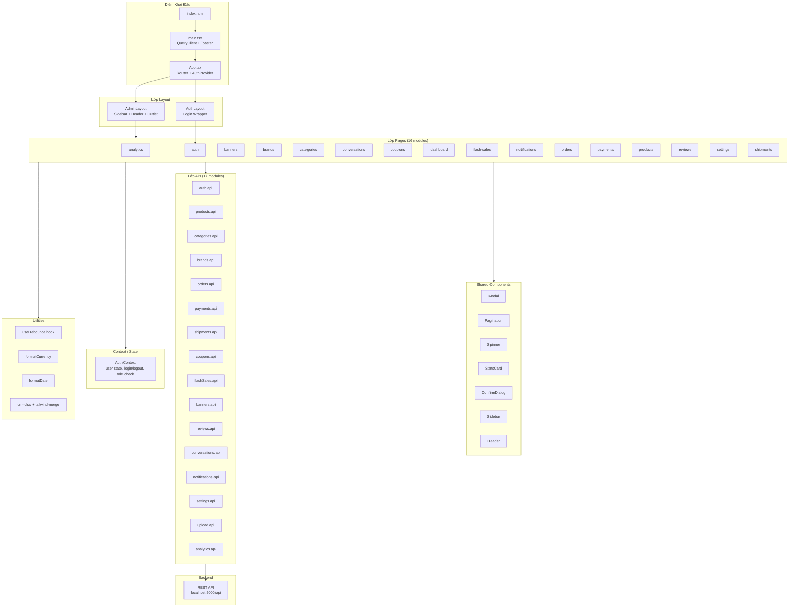
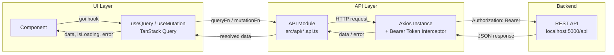
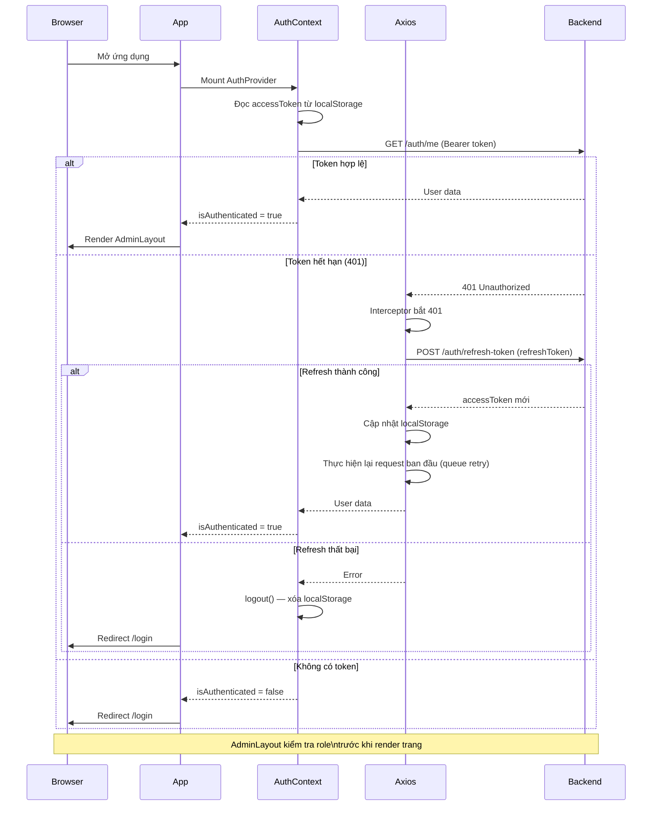

# Kiến Trúc Hệ Thống — ecommerce-admin

Tài liệu này mô tả kiến trúc tổng thể của dự án **ecommerce-admin**, một Single Page Application (SPA) xây dựng bằng React 18 + TypeScript + Vite.

---

## 1. Tổng Quan

**ecommerce-admin** là giao diện quản trị cho hệ thống thương mại điện tử. Ứng dụng giao tiếp với Backend REST API tại `http://localhost:5000/api` và cung cấp các tính năng quản lý toàn diện cho người quản trị.

### Công nghệ chính

| Lớp | Công nghệ |
|-----|-----------|
| UI Framework | React 18 |
| Ngôn ngữ | TypeScript |
| Build Tool | Vite |
| Routing | React Router v6 |
| State / Data Fetching | TanStack Query (React Query) |
| HTTP Client | Axios |
| Styling | Tailwind CSS |
| Form | React Hook Form + Zod |
| Thông báo | react-hot-toast |
| UI Components | @headlessui/react |

---

## 2. Sơ Đồ Kiến Trúc Tổng Thể



---

## 3. Mô Tả Các Lớp

### 3.1 Lớp Điểm Khởi Đầu (Entry)

| File | Vai trò |
|------|---------|
| `index.html` | HTML shell, mount point `<div id="root">` |
| `main.tsx` | Khởi tạo `QueryClient`, render `<Toaster>` (react-hot-toast), mount React app |
| `App.tsx` | Cấu hình Router, bọc `AuthProvider`, định nghĩa route tree |

### 3.2 Lớp Layout

- **AdminLayout**: Layout chính cho các trang admin — bao gồm `Sidebar` (navigation), `Header` (user info, actions), và `<Outlet>` (nội dung trang). Thực hiện kiểm tra role tại đây.
- **AuthLayout**: Layout đơn giản cho trang đăng nhập — chỉ render form đăng nhập, không có sidebar/header.

### 3.3 Lớp Pages (16 Feature Modules)

Mỗi module là một nhóm tính năng độc lập:

| Module | Chức năng |
|--------|-----------|
| `analytics` | Biểu đồ thống kê doanh thu, đơn hàng |
| `auth` | Đăng nhập, đăng xuất |
| `banners` | Quản lý banner quảng cáo |
| `brands` | Quản lý thương hiệu sản phẩm |
| `categories` | Quản lý danh mục sản phẩm |
| `conversations` | Hỗ trợ khách hàng, chat |
| `coupons` | Quản lý mã giảm giá |
| `dashboard` | Trang tổng quan, KPIs |
| `flash-sales` | Quản lý flash sale / khuyến mãi thời gian |
| `notifications` | Thông báo hệ thống |
| `orders` | Quản lý đơn hàng |
| `payments` | Quản lý thanh toán, hoàn tiền |
| `products` | Quản lý sản phẩm |
| `reviews` | Quản lý đánh giá sản phẩm |
| `settings` | Cấu hình hệ thống |
| `shipments` | Quản lý vận chuyển |

### 3.4 Shared Components

Các component dùng chung, không phụ thuộc vào feature cụ thể:

- **Modal**: Dialog overlay với backdrop
- **Pagination**: Điều hướng phân trang
- **Spinner**: Chỉ báo loading
- **StatsCard**: Card hiển thị số liệu thống kê
- **ConfirmDialog**: Dialog xác nhận hành động nguy hiểm
- **Sidebar**: Navigation sidebar với menu items
- **Header**: Header bar với thông tin user

### 3.5 Lớp API (17 Modules)

Mỗi module API là một named object export tập hợp các hàm gọi API liên quan đến resource đó. Toàn bộ calls đi qua Axios instance được cấu hình sẵn với Bearer token interceptor.

```
src/api/
├── auth.api.ts
├── products.api.ts
├── categories.api.ts
├── brands.api.ts
├── orders.api.ts
├── payments.api.ts
├── shipments.api.ts
├── coupons.api.ts
├── flashSales.api.ts
├── banners.api.ts
├── reviews.api.ts
├── conversations.api.ts
├── notifications.api.ts
├── settings.api.ts
├── upload.api.ts
└── analytics.api.ts
```

### 3.6 AuthContext

Quản lý toàn bộ trạng thái xác thực của ứng dụng:

- **State**: `user` object, `isLoading`, `isAuthenticated`
- **Actions**: `login()`, `logout()`, `checkRole()`
- **Bootstrap**: Gọi `authApi.me()` khi mount để khôi phục session từ localStorage
- **Truy cập**: Qua hook `useAuth()` trong bất kỳ component nào

### 3.7 Utilities

| Utility | Mô tả |
|---------|-------|
| `useDebounce` | Hook debounce cho search input, tránh gọi API quá nhiều |
| `formatCurrency` | Format tiền tệ theo định dạng Việt Nam (VND) |
| `formatDate` | Format ngày tháng theo locale |
| `cn()` | Kết hợp `clsx` + `tailwind-merge` để merge Tailwind class an toàn |

---

## 4. Luồng Dữ Liệu (Data Flow)



### Mô tả chi tiết

1. **Component** gọi `useQuery` hoặc `useMutation` từ TanStack Query
2. TanStack Query gọi `queryFn` / `mutationFn` — đây là các hàm từ API modules
3. **API Module** tổng hợp params và gọi Axios instance
4. **Axios interceptor** tự động đính kèm `Authorization: Bearer <accessToken>` vào header
5. **Backend** xử lý và trả về JSON response
6. Dữ liệu được cache bởi TanStack Query và trả về component dưới dạng `{ data, isLoading, error }`
7. **Mutations** sau khi thành công sẽ `invalidateQueries` để trigger refetch dữ liệu liên quan

---

## 5. Luồng Xác Thực (Auth Flow)



### Mô tả chi tiết

1. Khi ứng dụng mount, `AuthProvider` đọc `accessToken` và `refreshToken` từ `localStorage`
2. Gọi `authApi.me()` để xác minh token còn hợp lệ và lấy thông tin user
3. Nếu token hết hạn (401), Axios interceptor tự động gọi `/auth/refresh-token`
4. Nếu refresh thành công: lưu token mới, thực hiện lại request trong queue
5. Nếu refresh thất bại: gọi `logout()`, xóa localStorage, redirect về `/login`
6. **AdminLayout** thực hiện kiểm tra role — chặn truy cập nếu không đủ quyền

---

## 6. Cấu Trúc Thư Mục

```
ecommerce-admin/
├── public/
├── src/
│   ├── api/                    # 17 API modules
│   ├── components/             # Shared UI components
│   │   ├── layout/             # Sidebar, Header, AdminLayout, AuthLayout
│   │   └── ui/                 # Modal, Pagination, Spinner, StatsCard, ConfirmDialog
│   ├── contexts/               # AuthContext
│   ├── hooks/                  # useDebounce
│   ├── lib/                    # formatCurrency, formatDate, cn
│   ├── pages/                  # 16 feature modules
│   │   ├── analytics/
│   │   ├── auth/
│   │   ├── banners/
│   │   ├── brands/
│   │   ├── categories/
│   │   ├── conversations/
│   │   ├── coupons/
│   │   ├── dashboard/
│   │   ├── flash-sales/
│   │   ├── notifications/
│   │   ├── orders/
│   │   ├── payments/
│   │   ├── products/
│   │   ├── reviews/
│   │   ├── settings/
│   │   └── shipments/
│   ├── types/                  # TypeScript type definitions
│   ├── App.tsx                 # Router + AuthProvider
│   └── main.tsx                # QueryClient + Toaster + mount
├── index.html
├── vite.config.ts
├── tsconfig.json
└── package.json
```

---

## 7. Tích Hợp Ngoài (External Dependencies)

| Dependency | Mô tả |
|------------|-------|
| Backend REST API | `http://localhost:5000/api` — toàn bộ dữ liệu |
| Realtime | Polling 5 giây (không dùng WebSocket) — áp dụng cho notifications, conversations |
| File Uploads | Multipart FormData — qua `upload.api.ts` hoặc trực tiếp trên resource endpoints |

---

*Tài liệu được tạo tự động — cập nhật khi kiến trúc thay đổi.*
